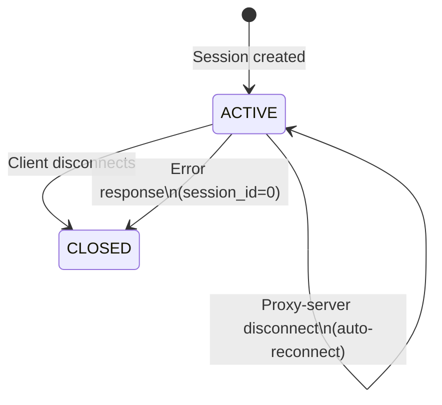
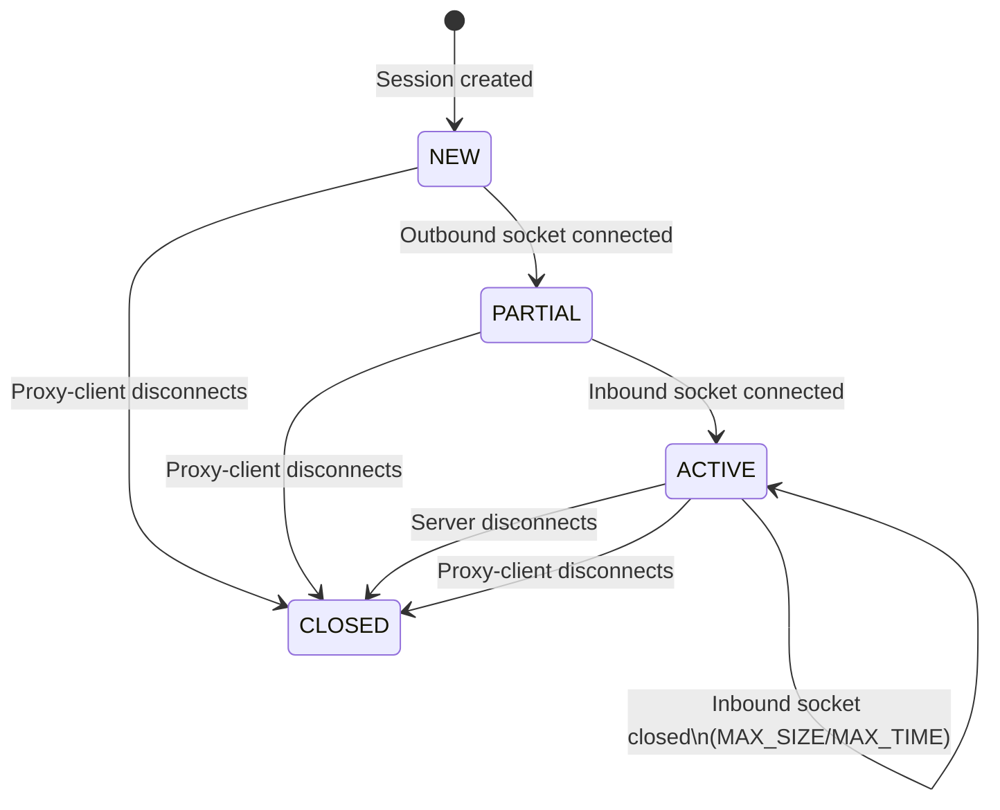

# ReconnectProxy Design Document

## Table of Contents
1. [Overview](#overview)
2. [Architecture](#architecture)
3. [Components](#components)
4. [Session Management](#session-management)
5. [Data Transfer Protocol](#data-transfer-protocol)
6. [Connection Handling](#connection-handling)
7. [Error Handling](#error-handling)
8. [State Machines](#state-machines)
9. [Usage Examples](#usage-examples)

**Implementation Details**: See [IMPLEMENTATION.md](IMPLEMENTATION.md) for detailed data structures, algorithms, and logging configuration.

---

## Overview

**System Type**: TCP Proxy System  
**Components**: 2 (proxy-client, proxy-server)  
**Primary Function**: Transparent TCP connection proxying with automatic reconnection

### Key Features
- **Transparent Proxying**: Clients connect to proxy-client as if it were the target server
- **Automatic Reconnection**: Sockets automatically reconnect when limits are reached
- **Session Persistence**: Sessions persist across socket reconnections
- **Bidirectional Data Transfer**: Simultaneous client→server and server→client data flow

---

## Architecture

### Component Diagram

```
+-----------+     +------------------+     +------------------+     +-----------+
|           |     |                  |     |                  |     |           |
|  Client   |<--->|  Proxy-Client    |<--->|  Proxy-Server    |<--->|  Server   |
| (Local)   |     |  (Listen Port)   |     |  (Proxy Port)    |     | (Remote)   |
|           |     |                  |     |                  |     |           |
+-----------+     +------------------+     +------------------+     +-----------+
```

### Component Roles

| Component | Role | Connection Direction |
|-----------|------|---------------------|
| **Proxy-Client** | Listens for client connections, manages sessions with proxy-server | Client → Proxy-Client → Proxy-Server → Server |
| **Proxy-Server** | Listens for proxy-client connections, manages sessions with target server | Proxy-Client → Proxy-Server → Server |

---

## Components

### Proxy-Client

**Purpose**: Acts as the local proxy endpoint that clients connect to

**Responsibilities**:
1. Listen for incoming client connections
2. Manage sessions with proxy-server (create, store, delete)
3. Handle bidirectional data transfer
4. Reconnect to proxy-server when connection is lost (if session exists)

**Command Line Arguments**:

| Argument | Description | Default | Required |
|----------|-------------|---------|----------|
| `--listen-port <port>` | Port to listen for client connections | - | Yes |
| `--listen-host <host>` | Host to bind to for listening | `127.0.0.1` | No |
| `--proxy-port <port>` | Port of proxy-server to connect to | - | Yes |
| `--proxy-host <host>` | Host of proxy-server to connect to | `127.0.0.1` | No |
| `--chunk-size <bytes>` | Maximum size of data chunks for transfer | `16` | No |
| `--max-size <bytes>` | Maximum total bytes to transfer before reconnection | `256` | No |
| `--max-time <seconds>` | Maximum time in seconds before reconnection | `5` | No |
| `--log-level <level>` | Log level: DEBUG, INFO, WARNING, ERROR | `INFO` | No |

---

### Proxy-Server

**Purpose**: Acts as the remote proxy endpoint that connects to the target server

**Responsibilities**:
1. Listen for incoming proxy-client connections
2. Manage sessions (create, store, delete)
3. Connect to the target server for each session
4. Handle bidirectional data transfer between proxy-client and server

**Command Line Arguments**:

| Argument | Description | Default | Required |
|----------|-------------|---------|----------|
| `--listen-port <port>` | Port to listen for proxy-client connections | - | Yes |
| `--listen-host <host>` | Host to bind to for listening | `127.0.0.1` | No |
| `--server-port <port>` | Port of target server to connect to | - | Yes |
| `--server-host <host>` | Host of target server to connect to | `127.0.0.1` | No |
| `--chunk-size <bytes>` | Maximum size of data chunks for transfer | `16` | No |
| `--max-size <bytes>` | Maximum total bytes to transfer before reconnection | `256` | No |
| `--max-time <seconds>` | Maximum time in seconds before reconnection | `5` | No |
| `--log-level <level>` | Log level: DEBUG, INFO, WARNING, ERROR | `INFO` | No |

---

## Session Management

### Session ID Specification

| ID Range | Meaning | Usage |
|----------|---------|-------|
| `0` | Special value for creating new sessions | Outbound socket only |
| `1-127` | Positive session IDs | Outbound data streams |
| `-127 to -1` | Negative session IDs | Inbound data streams |

**Session ID Rules**:
1. Session ID `0` is reserved for new session creation only
2. Negative IDs represent inbound data streams (e.g., `-42` for session `42`)
3. Session IDs wrap around after 127
4. Session ID `0` received as a response indicates an error

### Session States

| State | Description | Transition |
|-------|-------------|------------|
| **NEW** | Session created, waiting for proxy-client connection | Initial state |
| **ACTIVE** | Both sockets (inbound and outbound) established | After both sockets connected |
| **PARTIAL** | Only one socket established | During connection establishment |
| **CLOSED** | Session terminated | After client/server disconnect |

### Session Lifecycle

```
┌─────────────────────────────────────────────────────────────────────────────┐
│ Session Establishment Flow                                                  │
├─────────────────────────────────────────────────────────────────────────────┤
│ 1. Client connects to Proxy-Client                                          │
│ 2. Proxy-Client connects to Proxy-Server with session_id=0 (outbound)     │
│ 3. Proxy-Server connects to target server                                   │
│ 4. On success: Proxy-Server creates session, generates ID (e.g., 42)      │
│ 5. Proxy-Server sends session_id=42 to Proxy-Client                       │
│ 6. Proxy-Client stores session_id=42 for outbound data                    │
│ 7. Proxy-Client connects with session_id=-42 (inbound)                    │
│ 8. Proxy-Server finds session, sends -42 back                             │
│ 9. Session becomes ACTIVE, data transfer begins                           │
└─────────────────────────────────────────────────────────────────────────────┘
```

---

## Data Transfer Protocol

### Socket Types

| Socket Type | Direction | Session ID | Purpose |
|-------------|-----------|------------|---------|
| **Outbound** | Proxy-Client → Proxy-Server | Positive (1-127) or 0 | Creating new sessions, sending client→server data |
| **Inbound** | Proxy-Client → Proxy-Server | Negative (-127 to -1) | Sending server→client data |

### Session Establishment Sequence

```
PROXY-CLIENT                          PROXY-SERVER
     |                                     |
     |---- session_id=0 (new session) ---->|
     |                                     | (connects to server)
     |                                     | (creates session, ID=42)
     |                                     | (sends session_id=42 back)
     |<--- session_id=42 ------------------|
     |                                     |
     |---- session_id=-42 (inbound) ------>| 
     |                                     | (sends session_id=-42 back)
     |<--- session_id=-42 -----------------|
     |                                     |
     |<========== DATA TRANSFER ==========>|
```

### Error Cases

```
PROXY-CLIENT                          PROXY-SERVER
     |                                     |
     |---- session_id=0 (new session) ---->|
     |                                     | (server connection fails)
     |                                     | (sends session_id=0 back)
     |<--- session_id=0 (ERROR) -----------|
     | (delete session, close client)      |
     |                                     |
     |---- session_id=-42 (inbound) ------>| 
     |                                     | (session not found)
     |                                     | (sends session_id=0 back)
     |<--- session_id=0 (ERROR) -----------|
     | (delete session, close client)      |
```

---

## Data Transfer Algorithm

### Key Principle: Sender-Closes-Only

**Only the side that sends data closes its socket when limits are reached. The receiving side keeps its socket open to prevent data loss.**

| Direction | Sender | Socket Closed By | Reason |
|-----------|--------|------------------|--------|
| Client → Server | Proxy-Client | Proxy-client on MAX_SIZE/MAX_TIME | Proxy-client sends data to proxy-server |
| Server → Client | Proxy-Server | Proxy-server on MAX_SIZE/MAX_TIME | Proxy-server sends data to proxy-client |

### Outbound Data Flow (Proxy-Client → Proxy-Server)

```
┌─────────────────────────────────────────────────────────────────────────────┐
│ Outbound Data Transfer (Client → Server)                                  │
├─────────────────────────────────────────────────────────────────────────────┤
│ 1. Proxy-client establishes socket with session_id=0 (new session)        │
│ 2. Wait for proxy-server response                                          │
│ 3. If response is session_id=0:                                            │
│    - Delete session                                                        │
│    - Close client connection                                               │
│    - No further transfer                                                   │
│ 4. If response is positive session_id (1-127):                            │
│    - Session established                                                   │
│    - Send data in chunks (≤ CHUNK_SIZE)                                   │
│    - Close socket after MAX_SIZE bytes OR MAX_TIME seconds                │
│    - Proxy-server keeps socket open for buffered data                     │
└─────────────────────────────────────────────────────────────────────────────┘
```

### Inbound Data Flow (Proxy-Server → Proxy-Client)

```
┌─────────────────────────────────────────────────────────────────────────────┐
│ Inbound Data Transfer (Server → Client)                                   │
├─────────────────────────────────────────────────────────────────────────────┤
│ 1. Proxy-client establishes socket with negative session_id (-42)         │
│ 2. Wait for proxy-server response                                          │
│ 3. If response is session_id=0:                                            │
│    - Delete session                                                        │
│    - Close client connection                                               │
│    - No further transfer                                                   │
│ 4. If response is negative session_id:                                     │
│    - Session attached                                                      │
│    - Send data in chunks (≤ CHUNK_SIZE)                                   │
│    - Close socket after MAX_SIZE bytes OR MAX_TIME seconds                │
│    - Proxy-client keeps socket open for buffered data                     │
└─────────────────────────────────────────────────────────────────────────────┘
```

### Reconnection Behavior

When a socket is closed by **MAX_SIZE** or **MAX_TIME** limits:

| Aspect | Behavior |
|--------|----------|
| **Session State** | Persists (NOT deleted) |
| **Client Connection** | Remains alive |
| **Outbound Reconnect** | Use positive session ID (e.g., `session_id=42`) |
| **Inbound Reconnect** | Use negative session ID (e.g., `session_id=-42`) |
| **Data Counters** | Reset after reconnection |
| **Session Termination** | Only when client/server disconnects |

```
PROXY-CLIENT                          PROXY-SERVER
     |                                     |
     |---- session_id=42 (outbound) ----->|  (MAX_SIZE/MAX_TIME)
     |<--- socket closed ------------------|
     | (session persists)                  |
     |                                     |
     |---- session_id=42 (reconnect) ----->|  (outbound)
     |                                     | (session found, ACTIVE)
     |<--- session_id=42 ------------------|
     |                                     |
     |---- session_id=-42 (inbound) ------>|  (MAX_SIZE/MAX_TIME)
     |<--- socket closed ------------------|
     | (session persists)                  |
     |                                     |
     |---- session_id=-42 (reconnect) ----->| (inbound)
     |                                     | (session found, ACTIVE)
     |<--- session_id=-42 -----------------|
     |                                     |
     |<========== DATA TRANSFER ==========>|  (continues)
```

### Parameters

| Parameter | Description | Default | Unit |
|-----------|-------------|---------|------|
| `CHUNK_SIZE` | Maximum size of data chunks for transfer | `16` | bytes |
| `MAX_SIZE` | Maximum total bytes to transfer before reconnection | `256` | bytes |
| `MAX_TIME` | Maximum time in seconds before reconnection | `5` | seconds |

---

## Connection Handling

### Normal Termination

#### Client Disconnects
```
1. Proxy-client receives EOF from client
2. Proxy-client closes both sockets (inbound and outbound)
3. Proxy-client deletes session
```

#### Server Disconnects
```
1. Proxy-server receives EOF from server
2. Proxy-server closes both sockets (inbound and outbound)
3. Proxy-server deletes session
```

### Reconnection Triggers

| Trigger | Description |
|---------|-------------|
| **MAX_SIZE reached** | Socket closed after transferring maximum allowed bytes |
| **MAX_TIME elapsed** | Socket closed after maximum time duration |
| **Connection lost** | Network failure triggers automatic reconnection |
| **Session cleanup** | Session deleted after normal termination |

---

## Error Handling

### Session ID Conflicts

- Proxy-server maintains a session ID counter
- Wraps around after 127
- Skips 0 (reserved for new session creation)

### Session Not Found Scenarios

#### Outbound Socket Failure (New Session)

```
Scenario: Proxy-server fails to connect to target server

Action Sequence:
1. Proxy-server sends session_id=0 to Proxy-Client
2. Proxy-server closes socket
3. Proxy-Client MUST:
   - Delete the session (if any was partially created)
   - Close the client connection
   - No reconnection attempt should be made
```

#### Inbound Socket Failure (Session Not Found)

```
Scenario: Proxy-server receives inbound socket request with unknown session ID

Action Sequence:
1. Proxy-server sends session_id=0 to Proxy-Client
2. Proxy-server closes socket
3. Proxy-Client MUST:
   - Delete the session (if any was partially created)
   - Close the client connection
   - No reconnection attempt should be made
```

### Error Response Semantics

| Response | Meaning | Action Required |
|----------|---------|-----------------|
| `session_id=0` | Session establishment failed | Delete session, close client connection |
| `session_id>0` | Outbound session established | Use positive ID for outbound data |
| `session_id<0` | Inbound session attached | Use negative ID for inbound data |

---

## State Machines

### Overview

This section describes the session state machines for both proxy-client and proxy-server components.

**Note**: For detailed data structures and implementation code, see [IMPLEMENTATION.md](IMPLEMENTATION.md).

---

### Proxy-Client State Machine

#### States

| State | Description |
|-------|-------------|
| **ACTIVE** | Session active, sockets connected to proxy-server |
| **CLOSED** | Session terminated, client connection closed |

#### State Transitions

```
┌─────────────────────────────────────────────────────────────────────────────┐
│ Proxy-Client State Machine                                                  │
├─────────────────────────────────────────────────────────────────────────────┤
│                                                                             │
│  [INIT]                                                                     │
│      │                                                                      │
│      │ Session created                                                      │
│      ▼                                                                      │
│  +-------+                                                                  │
│  |ACTIVE |                                                                  │
│  +-------+                                                                  │
│      │                                                                      │
│      │ Client disconnects                                                   │
│      │ Socket reconnection (MAX_SIZE/MAX_TIME)                             │
│      │ Proxy-server disconnect (auto-reconnect)                            │
│      ▼                                                                      │
│  +-------+                                                                  │
│  |CLOSED |                                                                  │
│  +-------+                                                                  │
│                                                                             │
└─────────────────────────────────────────────────────────────────────────────┘
```

#### Transition Table

| Current State | Event | Next State | Action |
|---------------|-------|------------|--------|
| N/A | Session created | ACTIVE | Store session ID, connect to proxy-server |
| ACTIVE | Client disconnects | CLOSED | Close both sockets, delete session |
| ACTIVE | Socket reconnection (MAX_SIZE/MAX_TIME) | ACTIVE | Close socket, reset counters, reconnect |
| ACTIVE | Proxy-server disconnect | ACTIVE | Attempt reconnection with session ID |
| ACTIVE | Error response (session_id=0) | CLOSED | Delete session, close client connection |

#### Proxy-Client State Diagram (Mermaid)



---

### Proxy-Server State Machine

#### States

| State | Description |
|-------|-------------|
| **NEW** | Session created, waiting for proxy-client connection |
| **PARTIAL** | Only one socket established (outbound or inbound) |
| **ACTIVE** | Both sockets (inbound and outbound) established |
| **CLOSED** | Session terminated |

#### State Transitions

```
┌─────────────────────────────────────────────────────────────────────────────┐
│ Proxy-Server State Machine                                                  │
├─────────────────────────────────────────────────────────────────────────────┤
│                                                                             │
│  [INIT]                                                                     │
│      │                                                                      │
│      │ Session created                                                      │
│      ▼                                                                      │
│  +-------+                                                                  │
│  |  NEW  |                                                                  │
│  +-------+                                                                  │
│      │                                                                      │
│      │ Outbound socket connected                                            │
│      ▼                                                                      │
│  +-------+                                                                  │
│  |PARTIAL|                                                                  │
│  +-------+                                                                  │
│      │                                                                      │
│      │ Inbound socket connected                                             │
│      ▼                                                                      │
│  +-------+                                                                  │
│  |ACTIVE |                                                                  │
│  +-------+                                                                  │
│      │                                                                      │
│      │ Server disconnects                                                   │
│      │ Proxy-client disconnects                                             │
│      ▼                                                                      │
│  +-------+                                                                  │
│  |CLOSED |                                                                  │
│  +-------+                                                                  │
│                                                                             │
└─────────────────────────────────────────────────────────────────────────────┘
```

#### Transition Table

| Current State | Event | Next State | Action |
|---------------|-------|------------|--------|
| NEW | Outbound socket connected | PARTIAL | Store outbound socket |
| PARTIAL | Inbound socket connected | ACTIVE | Store inbound socket |
| ACTIVE | Outbound socket closed (MAX_SIZE/MAX_TIME) | ACTIVE | Reset outbound counters |
| ACTIVE | Inbound socket closed (MAX_SIZE/MAX_TIME) | ACTIVE | Reset inbound counters |
| ACTIVE | Server disconnects | CLOSED | Close all sockets, delete session |
| ACTIVE | Proxy-client disconnects | CLOSED | Close all sockets, delete session |
| PARTIAL | Proxy-client disconnects | CLOSED | Close all sockets, delete session |
| NEW | Proxy-client disconnects | CLOSED | Close socket, no session created |

#### Proxy-Server State Diagram (Mermaid)



---

### Session Establishment Flow (Detailed)

```
┌─────────────────────────────────────────────────────────────────────────────┐
│ Session Establishment Sequence                                              │
├─────────────────────────────────────────────────────────────────────────────┤
│                                                                             │
│  PROXY-CLIENT                          PROXY-SERVER                         │
│       |                                     |                               │
│       |  [NEW]                              |                               │
│       |----- session_id=0 (outbound) ----->|  Create session               │
│       |                                     |  Connect to server            │
│       |                                     |  [NEW → PARTIAL]              │
│       |                                     |<-- session_id=42 (OK)         │
│       |<---- session_id=42 (OK) -----------|  Store session ID=42          │
│       |  [ACTIVE]                           |                               │
│       |                                     |                               │
│       |----- session_id=-42 (inbound) ---->|  Find session ID=42           │
│       |                                     |  [PARTIAL → ACTIVE]           │
│       |                                     |<-- session_id=-42 (OK)        │
│       |<---- session_id=-42 (OK) ----------|  Attach inbound socket        │
│       |                                     |  Data transfer begins         │
│       |<========== DATA TRANSFER ==========>|                               │
│                                                                             │
└─────────────────────────────────────────────────────────────────────────────┘
```

---

## Usage Examples

### Start Proxy-Server

```bash
python proxy_server.py \
    --listen-port 1080 \
    --listen-host 0.0.0.0 \
    --server-port 8080 \
    --server-host 192.168.1.100 \
    --chunk-size 8192 \
    --max-size 1048576 \
    --max-time 300 \
    --log-level INFO
```

### Start Proxy-Client

```bash
python proxy_client.py \
    --listen-port 8080 \
    --listen-host 127.0.0.1 \
    --proxy-port 1080 \
    --proxy-host 192.168.1.100 \
    --chunk-size 8192 \
    --max-size 1048576 \
    --max-time 300 \
    --log-level INFO
```

### Full Flow Example

```bash
# Terminal 1: Start proxy-server with custom parameters
python proxy_server.py \
    --listen-port 1080 \
    --server-port 80 \
    --chunk-size 4096 \
    --max-size 524288 \
    --max-time 60

# Terminal 2: Start proxy-client with custom parameters
python proxy_client.py \
    --listen-port 8080 \
    --proxy-port 1080 \
    --chunk-size 4096 \
    --max-size 524288 \
    --max-time 60

# Terminal 3: Connect to proxy-client
curl --proxy localhost:8080 http://example.com
```

---

## Data Flow Summary

### Client → Server Direction
```
Client → Proxy-Client (outbound socket, +session_id)
       → Proxy-Server (outbound socket, +session_id)
       → Server
```

### Server → Client Direction
```
Server → Proxy-Server (inbound socket, -session_id)
       → Proxy-Client (inbound socket, -session_id)
       → Client